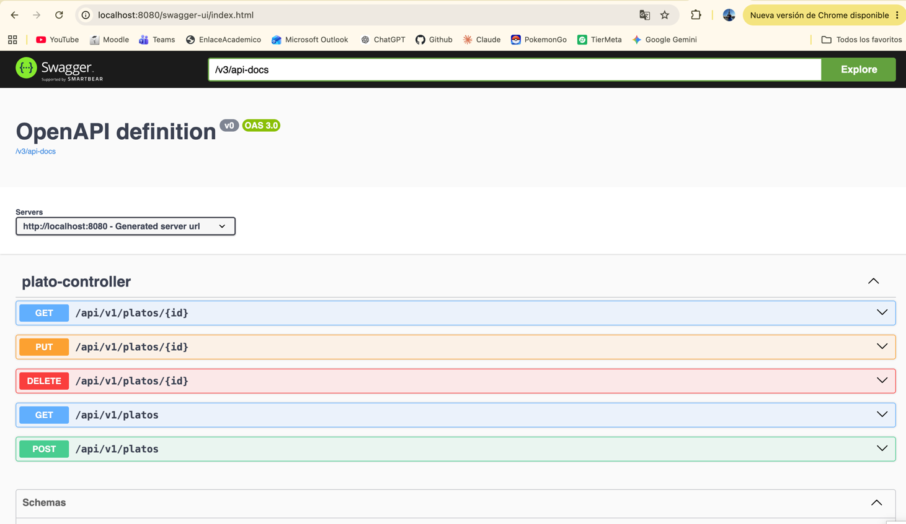

# Bitacora_Corte2_CristianMoreno

# Bitacora_Corte2_CristianMoreno

## LA BRASA VIVA

**LA BRASA VIVA** es una plataforma web que digitaliza la operación de un restaurante de parrilla: consulta de la carta, armado y confirmación del pedido, preparación en cocina y cierre de la cuenta con su pago.

**Autor:** Cristian Santiago Moreno Ruiz

## Diagramas

## Estructura del proyecto

Arquitectura en capas: `Controller` → `Service` → `Repository`, con DTOs, Mappers, Validadores y manejo global de excepciones.

## Endpoints

_(Tabla de endpoints por funcionalidad — se completará a medida que se implementen los controladores)_

## Swagger 

